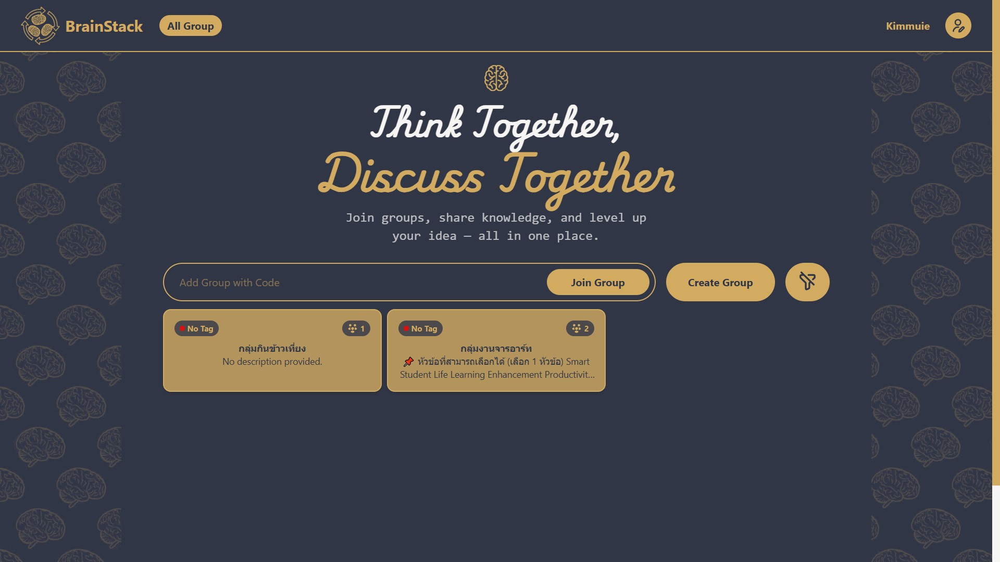
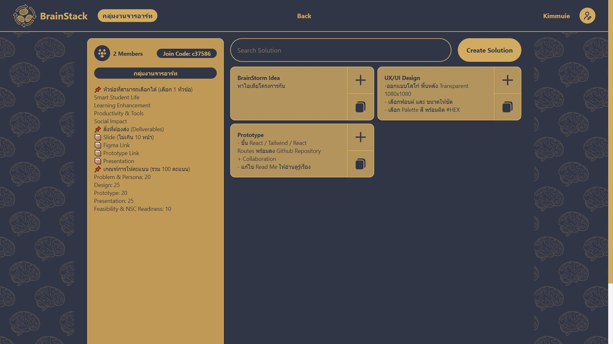
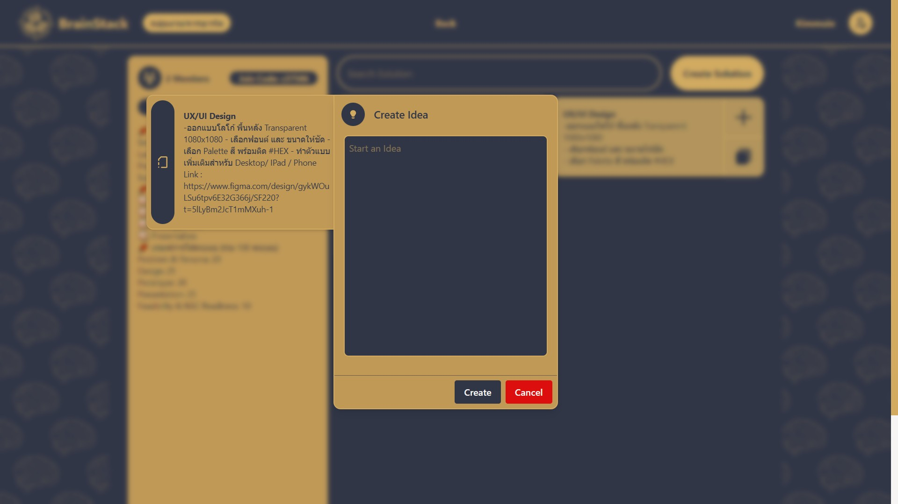
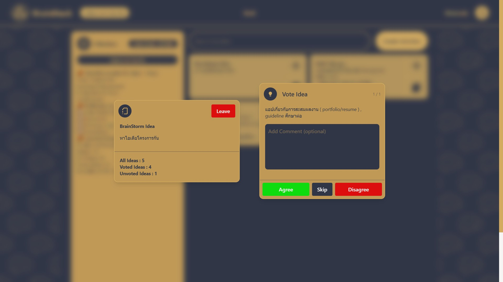
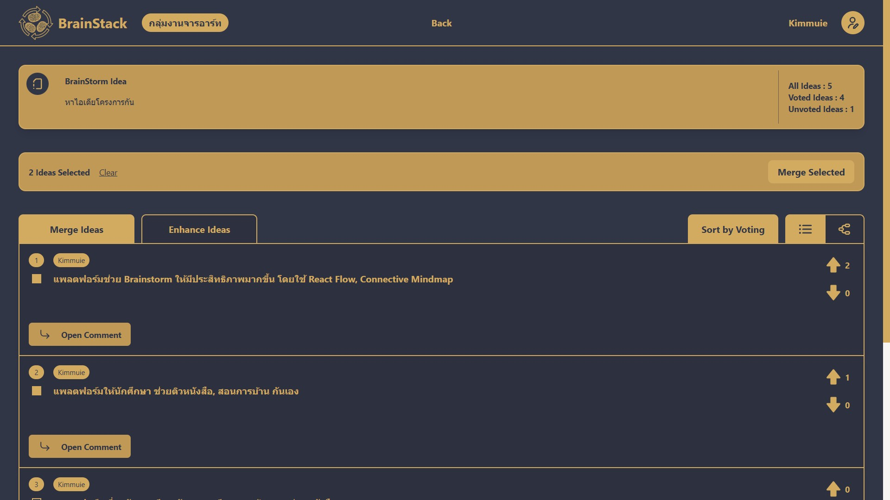
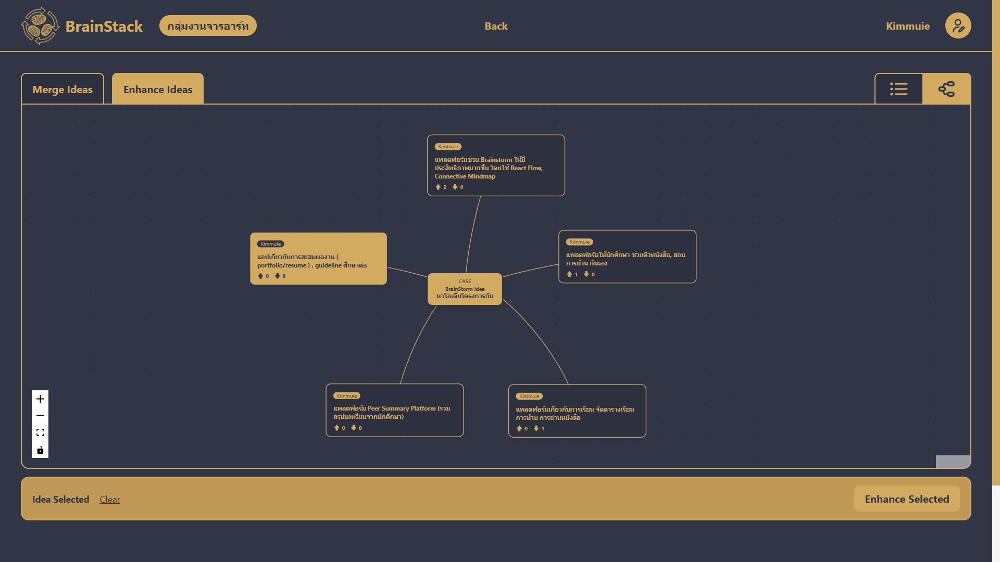

# BrainStack

### 💡 What is [BrainStack](https://brain-stack-theta.vercel.app/)?
**BrainStack Website** is a collaborative brainstorming platform designed to make group ideation more organized, inclusive, and efficient. It addresses the common "chaos" of brainstorming where ideas get lost in chat histories or certain voices dominate the conversation by providing a structured, real-time environment for teams to propose, vote on, and refine ideas.Whether you are a student working on a group project or a project manager leading a sprint, BrainStack helps you move from a messy pile of thoughts to a clear, actionable "Top Idea".
 

### 🔗 Live Website: https://brain-stack-theta.vercel.app/

### 🚀 Features
1. **Collaborative Workspaces**
  - User Authentication: Integrated with Firebase Auth for a personalized experience
  - Secure Access: Join groups easily via unique codes or invite links
  - Real-time Interaction: Propose ideas and see feedback from teammates instantly.
2. **Structured Ideation Tools**
  - Flashcard Voting: Ideas are presented as a deck of cards. Users can quickly click to "Agree" or "Disagree," reducing decision paralysis.
  - Problem Context: Keep the goal in sight with a "Question Card" that displays the project task while you brainstorm.
  - Discussion Threads: Deep-dive into specific ideas with integrated micro-comments.
3. **Data-Driven Selection**
  - All Idea Overview: A dashboard that summarizes voting results, showing Upvotes, Downvotes, and Comment counts.
  - Smart Sorting: Automatically rank ideas by quality or engagement (votes/comments) to find the best concepts quickly.
  - List/Mindmap View: A visual canvas to see the relationship between different tasks and sub-ideas.

### 📈 Future Improvements
- AI-Powered Refactoring: Use Generative AI to merging/enhancing rough ideas into professional action plans.
- AI Critic: Automatically identify potential risks or "pain points" within proposed ideas.
 
 

### 🛠️ Tech Stack

  

### 🖥️ Website Interface

  
  
  
  
  
  

## License
This project is licensed under the MIT License — see the [LICENSE](LICENSE) file for details.
